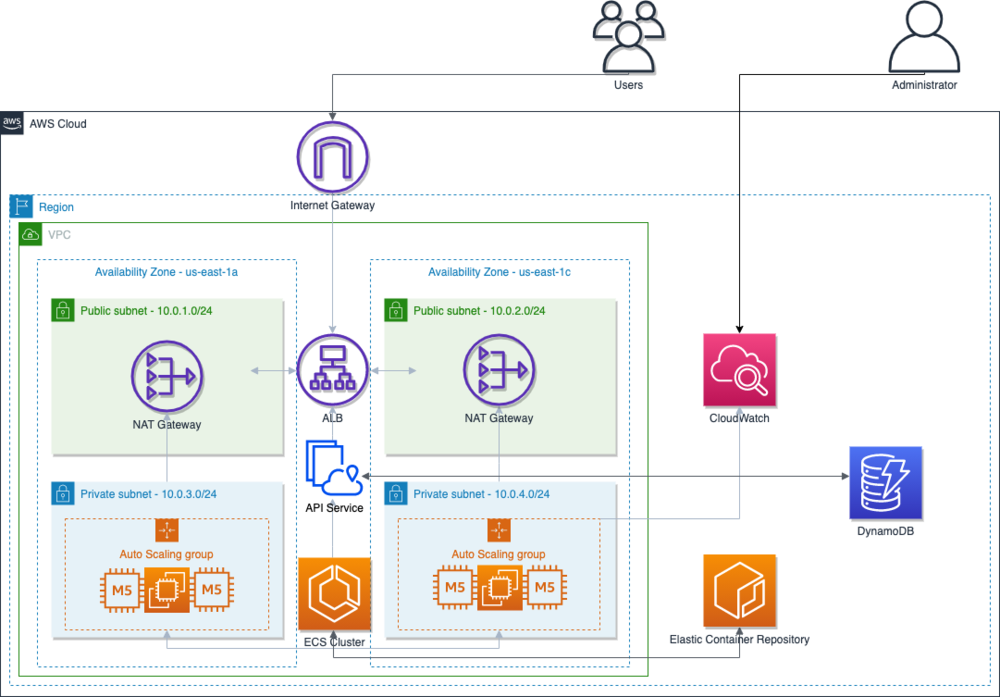

# KnowledgeGraph-Terraform-Flask-app

_Description:_ API to generate Knowledge Graphs from [arxiv.org](https://arxiv.org)

_Author:_ [Yann CLERC](https://github.com/yclerc)

---
**Table of Contents**  
- [General info](#general-info)
- [Install](#install)
  - [Dependencies](#dependencies)
  - [Install locally](#install-locally)
  - [Select endpoint for database](#select-endpoint-for-database)
  - [Run](#run)
  - [Test](#test)
  - [Docker locally](#docker-locally)
- [Deploy with IaaC](#deploy-with-iaac)
  - [Docker push to AWS](#docker-push-to-aws)

---
**To Do (dev):** 
- create route to show what is already in DB
- update root definitions in README.md
- perform large batch from local to AWS DB endpoint
- document API with swagger 
- onto url with arxiv id instead of title --> Done
- clean code --> Done
- delete downloaded files --> Done
- route to add by arxiv_ID --> Done
- push to github --> Done
---

# General info
This project deploys an API on AWS according to the following workflow:

	

# Install

## Dependencies

This package requires python 3 (including venv), git and a recent OS

## Install locally 

Clone and go to the newly created repository :

    $ git clone <https address>
    $ cd KnowledgeGraph-Terraform-Flask-app

Create a virtualenv and activate it: (here our venv is called "deploy")

    $ python -m venv deploy
    $ source deploy/bin/activate

Or on Windows cmd:

    $ python -m venv deploy
    $ deploy\Scripts\activate

Install requirements from txt file:

    $ pip install -r requirements.txt

## Select endpoint for database

Various DB available: 

    - local DynamoDB, for integration testing
    - hosted MongoDB Atlas DB, initial choice to expose the API (ask admin for credentials)
    - hosted AWS DynamoDB, for production 

Select chosen option by commenting/uncommenting related lines in models/model.py

If you wish to use a local DynamoDB, you should configure it using the following commands:
Refer to this [tutorial](https://docs.aws.amazon.com/amazondynamodb/latest/developerguide/DynamoDBLocal.html) for details.

    $ aws dynamodb create-table     --table-name arxivTable     --attribute-definitions AttributeName=_id,AttributeType=S --key-schema AttributeName=_id,KeyType=HASH     --billing-mode PAY_PER_REQUEST --endpoint-url http://localhost:8000

If needed, you can destroy the table using the command: 

    $ aws dynamodb delete-table --table-name arxivTable --endpoint-url http://localhost:8000

## Run

    $ cd app/
    $ python app.py

Open http://localhost:5000 in a browser to interact with the API 

## API specification

### Upload a file

Post a file to the server:

**Request**

    HTTP Methode: POST
    Route: /

### Check an uploaded file

Get the status of an uploaded file and show his meta data:

**Request**

    HTTP Methode: GET
    Route: /documents/<id>
    # Replace <id> by ID of the chosen document
    # The ID was returned in response of an upload file request

### Text of an uploaded file

Get content of an uploaded file:

**Request**

    HTTP Methode: GET
    Route: /text/<id>
    # Replace <id> by ID of the chosen document
    # The ID was returned in response of an upload file request

## Test
### pylint

    $ python -m pylint <filename>.py

### pytest

    $ python -m pytest

## Docker locally

build and run container using following commands.

    $ docker build -t KnowledgeGraph-Terraform-Flask-app .
    $ docker run -d -p 5000:5000 KnowledgeGraph-Terraform-Flask-app
    $ curl http://localhost:5000

# Deploy with IaaC

Resulting architecture generated in AWS :

Refer to this [tutorial](https://aws.amazon.com/blogs/opensource/deploying-python-flask-microservices-to-aws-using-open-source-tools/) for details.

## Docker push to AWS
---
**NB:** 
This step assumes you already have a configured programatic access to an active AWS account 

---

Create repository on AWS ECR:

    $ aws ecr create-repository --repository-name KnowledgeGraph-Terraform-Flask-app --image-scanning-configuration scanOnPush=true --region eu-west-3 

Get credentials:

    $ aws ecr get-login-password --region eu-west-3 | docker login --username AWS --password-stdin 327059905592.dkr.ecr.eu-west-3.amazonaws.com/flask-docker-demo-app

