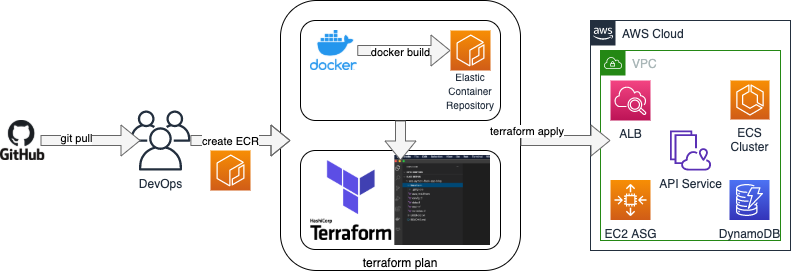

# KnowledgeGraph-Terraform-Flask-app

- _Description:_ Deployment framework to AWS for secure, autoscaling, High-Availability microservices
- _Provided microservice:_ In this example, we use an API generating Knowledge Graphs from [arxiv.org](https://arxiv.org)
- _Use:_
    * with provided flask app, no modifications required 
    * with your own flask app
        - replace the content of folder [./app/](./app/) by your own miscroservice
        - update requirements.txt
        - update Dockerfile
        - update terraform files config.tf and variables.tf
        - That's it ! 
---

**NB:** Feel free to contribute to this project by creating issues :) 

---
**Table of Contents**  
- [General info](#general-info)
- [Flask App](#flask-app)
  - [App folder structure](#app-folder-structure)  
  - [Functional blocks ](#functional-blocks)  
- [Install](#install)
  - [Quickstart](#quickstart)
  - [Select endpoint for database](#select-endpoint-for-database)
  - [Launch microservice on localhost](#launch-microservice-on-localhost)
  - [Docker locally](#docker-locally)
- [Deploy](#deploy)
  - [Docker push to AWS](#docker-push-to-aws)
  - [Deploy Terraform plan](#deploy-terraform-plan)
  - [Remove deployed architecture](#remove-deployed-architecture)
- [Use](#use)
  - [API manager](#api-manager)
  - [Best practices](#best-practices)  
  - [Test](#test)
  - [Monitor](#monitor)
  - [Work with generated ontology](#work-with-generated-ontology)
 

---

# General info
This project deploys an API on AWS according to the following workflow:

	

# Flask App 

## [./app](./app) folder structure 

- downloads/ --------- temp folder when downloading pdf from arxiv
- models/ ------------- helper functions for app.py
- ontologies/ --------- to store generated ontology world.owl
- templates/ ---------- html templates for rendering in web browser (not supported in this version)
- tests/ ---------------- test scripts for pytest (not supported in this version)
- uploads/ ------------ folder to stage manually pdf documents for upload (not supported in this version)
- app.py -------------- flask app and main routes
- Dockerfile ---------- to build container 
- requirements.txt --- project dependencies generated using [pipreqs](https://pypi.org/project/pipreqs/) package 

## Functional blocks
- Web Scrapping
    - queries through python [arxiv API](https://pypi.org/project/arxiv/)
- Natural Language Processing
    - use spacy with pre-trained [en_core_web_sm model](https://spacy.io/models/en#en_core_web_sm)
- Ontology / Knowledge Graph  
    - use [owlready2](https://owlready2.readthedocs.io/en/latest/)
    - currently does not start from [foaf](http://xmlns.com/foaf/spec/) model (due to import bug in Protégé)
    

# Install

## Quickstart

Global dependencies: (please refer to links for installation tutorials if necessray)
- recent OS
- [git](https://git-scm.com)
- [Python](https://www.python.org/downloads/)  (including venv)
- AWS [Account](https://aws.amazon.com/resources/create-account/) & [CLI](https://docs.aws.amazon.com/cli/latest/userguide/cli-chap-getting-started.html)
- [Docker Desktop](https://www.docker.com/get-started) 
- [Terraform](https://www.terraform.io)
- [Protégé](https://protege.stanford.edu)

Clone and go to the newly created repository :

    $ git clone <https address>
    $ cd KnowledgeGraph-Terraform-Flask-app

Create a deployment virtualenv and activate it: 

    # for UNIX systems:
    $ python -m venv deploy_venv
    $ source deploy_venv/bin/activate

    # for Windows systems:
    $ python -m venv deploy_venv
    $ deploy venv\Scripts\activate

Install requirements from txt file:

    $ pip install -r requirements.txt

## Select endpoint for database

Various DB available: 

    - local DynamoDB, for integration testing
    - hosted AWS DynamoDB, for production 

Select chosen option by commenting/uncommenting related lines in [models/model.py](./app/models/model.py)

If you wish to use a local DynamoDB, you should configure it using the following commands:
Refer to this [tutorial](https://docs.aws.amazon.com/amazondynamodb/latest/developerguide/DynamoDBLocal.html) for details.

1. download DynamoDB .zip package from the tutorial

2. extract package to chosen location

3. from a bash shell, at this location, launch  DynamoDBLocal.jar with:

        $ java -Djava.library.path=./DynamoDBLocal_lib -jar DynamoDBLocal.jar -sharedDb

4. keep this shell window open to use your DB
5. in another shell tab, create your table 

        $ aws dynamodb create-table --table-name arxivTable     --attribute-definitions AttributeName=_id,AttributeType=S --key-schema AttributeName=_id,KeyType=HASH --billing-mode PAY_PER_REQUEST --endpoint-url http://localhost:8000
6. check if th etable exists
        $ aws dynamodb list-tables --endpoint-url http://localhost:8000

7. When needed, you can destroy the table using the command: 

        $ aws dynamodb delete-table --table-name arxivTable --endpoint-url http://localhost:8000

## Launch microservice on localhost

    $ cd app/
    $ python app.py

Open http://localhost:5000 in a browser to interact with the API 

## Docker locally

build and run container using following commands.

    $ docker build -t knowledgegraph-terraform-flask-app .
    $ docker run -d -p 5000:5000 knowledgegraph-terraform-flask-app
    $ curl http://localhost:5000

# Deploy

Resulting architecture generated in AWS :

Refer to this [tutorial](https://aws.amazon.com/blogs/opensource/deploying-python-flask-microservices-to-aws-using-open-source-tools/) to get more details. Use commands below to ensure proper deployment.

## Docker push to AWS
---
**NB:** 
This step assumes you already have a configured programatic CLI access to an active AWS account.
Refer to this [tutorial](https://docs.aws.amazon.com/cli/latest/userguide/cli-configure-quickstart.html) for more details. 

Make sure to select proper DB endpoint (AWS hosted DynamoDB) in [models/model.py](./app/models/model.py) before building your container.

---

Create repository on AWS ECR:

    $ aws ecr create-repository --repository-name knowledgegraph-terraform-flask-app --image-scanning-configuration scanOnPush=true --region eu-west-3 

Get credentials:

---
**NB:** 
Insert your actual AWS ID in the following command lines.

    $ aws ecr get-login-password --region eu-west-3 | docker login --username AWS --password-stdin <AWS_ID>.dkr.ecr.eu-west-3.amazonaws.com/knowledgegraph-terraform-flask-app

From your browser open the AWS Console, open Services, Elastic Container Registry. 

Select the knowledgegraph-terraform-flask-app. The ECR URI will be needed later on.

Back to the shell, log into the ECR service of your AWS account (use your own AWS_ID) with the following commands.

Tag and push to ECR:

    $ docker tag knowledgegraph-terraform-flask-app:latest <AWS_ID>.dkr.ecr.eu-west-3.amazonaws.com/knowledgegraph-terraform-flask-app:latest

    $ docker push <AWS_ID>.dkr.ecr.eu-west-3.amazonaws.com/knowledgegraph-terraform-flask-app:latest

## Deploy Terraform plan 

    $ cd ../terraform
    $ terraform init
---
The Terraform code will deploy the following configuration:
- IAM: Identity access management policy configuration
- VPC: Public and private subnets, routes, and a NAT Gateway
- EC2: Autoscaling implementation
- ECS: Cluster configuration
- ALB: Load balancer configuration
- DynamoDB: Table configuration
- CloudWatch: Alert metrics configuration
---

    # check configuration files:
    $ terraform validate 

    # prepare and review execution plan:
    # this command prompts for a valid ECR URI (see AWS console)
    $ terraform plan  
    
    # deploy plan to AWS:
    # this command prompts for a valid ECR URI (see AWS console)
    # then type 'yes' when prompted to launch execution
    $ terraform apply 

The execution may take a while.
If successful, the output will be the newly created URI for our API endpoint.
Copy and paste this URI to your browser in order to access the API. 

## Remove deployed architecture 

Delete the API completely from AWS: 

    $ terraform destroy

You can finally delete the ECR registry directly from your browser in AWS console. 

In case of errors during deletion, check manually from AWS Console for services that are still up and running. 

# Use

## API manager 

An API contract is provided through [Postman API Platform](https://www.postman.com), based on [OpenAPI](https://www.youtube.com/watch?v=InE6Odx--xo) specifications.

See API contracts for information on the [KnowledgeGraph-Terraform-Flask-app](.) API and available routes:

- [Local API Contract](https://documenter.getpostman.com/view/20033934/UVsLS6ja)
- TO DO for cloud hosted solution

See these [resources](https://idratherbewriting.com/learnapidoc/index.html) for more content on how to document APIs

## Use scenarii

To Do: programatic access for tester in fully hosted scenarii??
--> AWS IAM role and associated acces keys for DynamoDB ???

### Test fully hosted microservice
- Go to provided endpoint 
- Security, access restriction: TBD
- Upload unit file
- **Upload batch not supported** 
- Generate ontology 

_OR_ 

### Deploy your own cloud hosted microservice 
- Follow [Deploy](#deploy) section
- with your endpoint, same steps as for fully hosted microservice
- Launch API from your machine to perform batch imports

_OR_ 

### Test your own microservice on localhost 
- launch local API instance (with either local or remote DynamoDB)
- with your endpoint, same steps as for fully hosted microservice
- Perform batch imports (for instance, batch size = increasing multiples of 10)

---
**NB:** 
- The fully hosted Flask app relies extensively on network connectivity. 
- Always prefer to launch batch imports from local API instance
- An area of improvement could be to use a cache such as [celery](https://flask.palletsprojects.com/en/1.1.x/patterns/celery/).
- Another option would be to tweak parameters of the architecture, especially limitations on: 
    - Internet Gateway, 
    - NAT Gateway, 
    - Application Load Balancer.

---
Example of successful batch request from local API instance, 10 documents, elapsed time: 3 min

### Code testing librairies
Testing not yet maintained in this version. 
Tech stack to use: 

**black**:
Clean code automatically on app files by using black package

    $ black <filename>.py 

**pylint**:
Rate code quality and suggests improvements

    $ python -m pylint <filename>.py

**pytest**: Perform unit tests from [tests](./app/tests/) folder and check coverage

    $ python -m pytest --cov

## Monitor
Monitor you microservice from [AWS CloudWatch](https://aws.amazon.com/cloudwatch/)

Follow this [tutorial](https://www.bluematador.com/blog/how-to-monitor-amazon-dynamodb-with-cloudwatch) to implement monitoring. 

## Work with generated ontology 

- Install [Protégé](https://protege.stanford.edu) on your machine
- Open downloaded file [worl.owl](./app/ontologies/world.owl) 
- Launch [reasoner](https://protegewiki.stanford.edu/wiki/Using_Reasoners) in Protégé (Pellet)
- Visualize Graph using Protégé plug-in OntoGraf

Example of Knowledge Graph obtained in Protégé:

